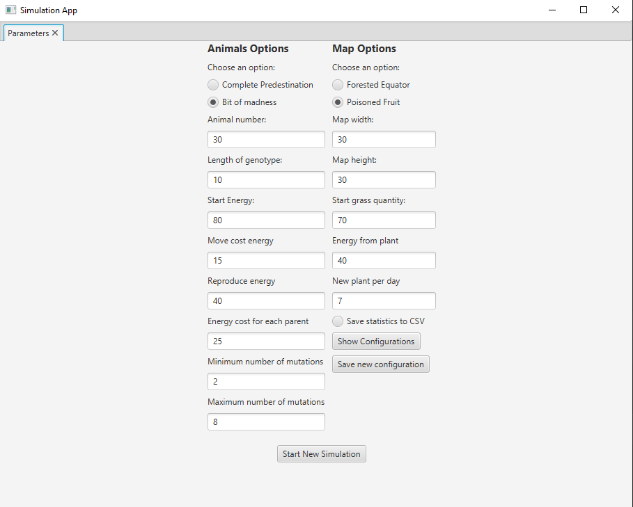
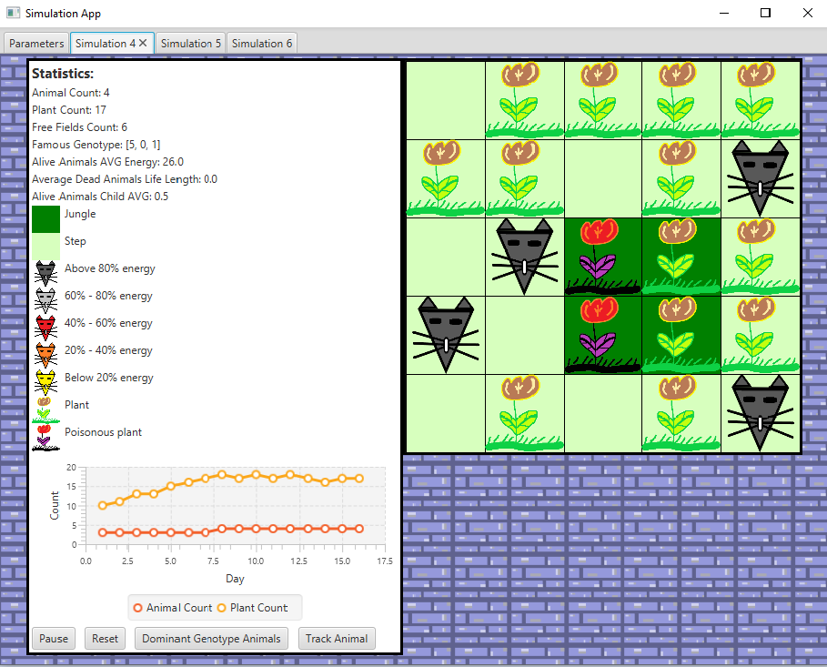
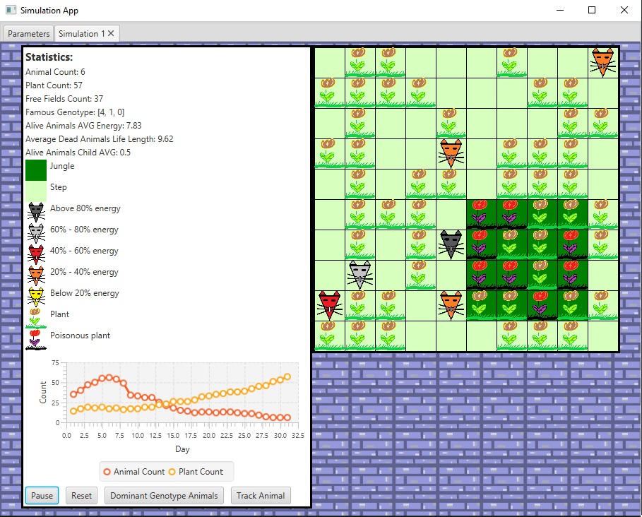
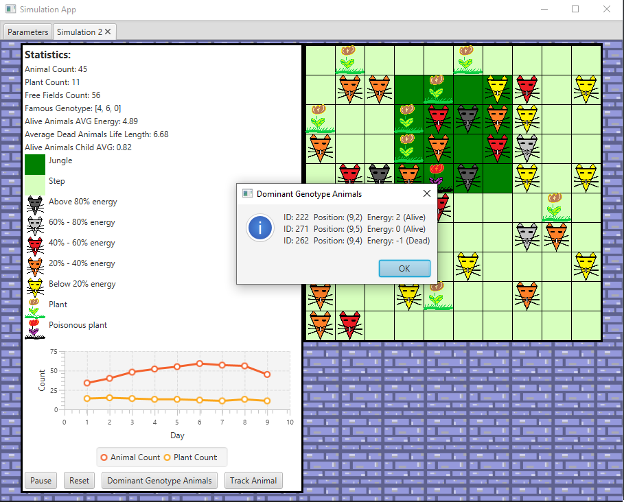
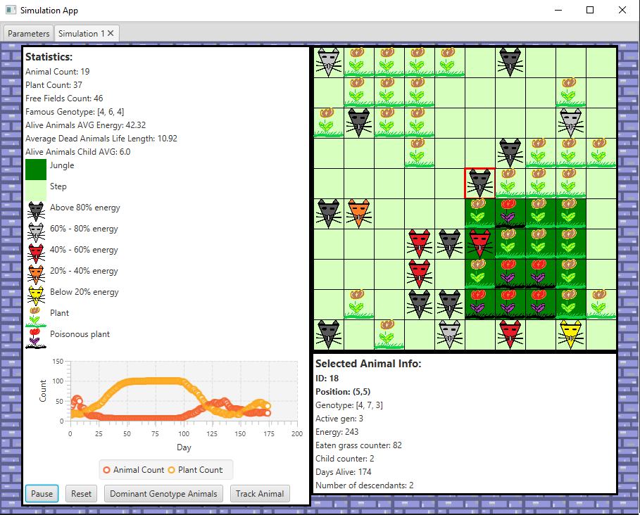
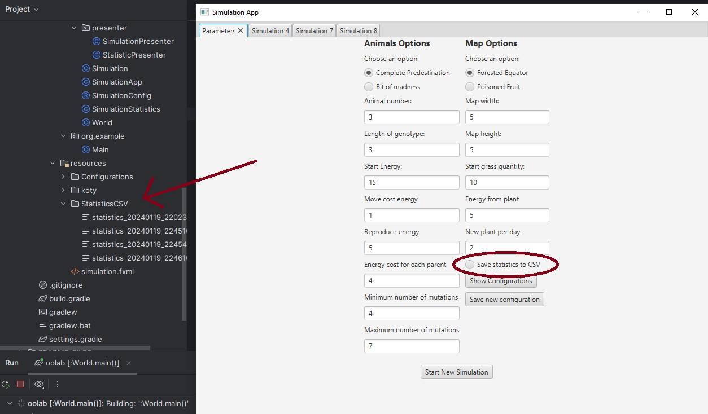
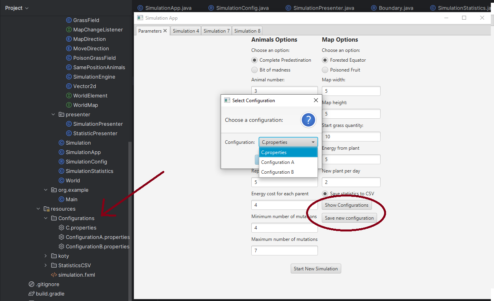

# Darwin Simulator

## Simple simulator made for Object Oriented Programming course (PO) at AGH 2023/24.

## Technologies used:
- Java
- JavaFX

# Concept:
This simulator is based on simple Darwin's Theory - only strongest organisms can survive. Every day animals move, eat and reproduce. When they run out of energy they die. Every animal has genetype and his own energy level.
The colourful squares symbolize animals and plants according to the legend.

# Before simulation

Simulation takes place on the step-map with jungle which takes up about 20% of the entire map. Depending on the selected mode, the jungle can take the form of a square or an equator. Before simulation user can choose his own options: size of the step and jungle, start number of animals and plants, the amount of energy the animals get at the beginning, the amount of energy animals lose while moving and reproducing and the amount of energy the animals get after eating a plant. We can also choose whether the animal should move according to its genotype or, in 80% of cases, after executing a gene, the animal activates the gene immediately following it, but in 20% of cases it jumps to another, random gene.
We can also choose the mode with an additional poisonous plant which the animals have a chance to avoid, but when they eat it, it will take away some of their energy.

# Simulation
Simulation can be stopped/restarted/ended at any time. Several simulations can be run simultaneously.

Every day:

- all dead animals are removed from the map (animal dies when his energy is equal or smaller than 0)
- every animal change his direction (it cost them energy)
- the strongest animal in field eats the plant on it
- if there are at least 2 animals (if more, the strongest 2 are chosen) in the field and they have enough energy, they can breed. Child inherits the geneotype and gets the initial amount of energy from each parent.
- as many plants appear on the map as were specified at the beginning. A plant has an 80% chance of appearing in a jungle hex if all jungle hexes are occupied, it always appears in the step. 
- all statistics are updated

# Simulation Pause
When the simulation is stopped we can see animals with the dominant genotype. We can also choose one animal to track its position on the map and its statistics.

# Other options

## Save to CSV file
After clicking on "Save to CSV file" all statistics will be saved to CSV file.

## Configurations
It is also possible to use previously prepared simulation settings and add new settings

Other specifications about this project can be found here: https://github.com/Soamid/obiektowe-lab/blob/master/proj/Readme.md

